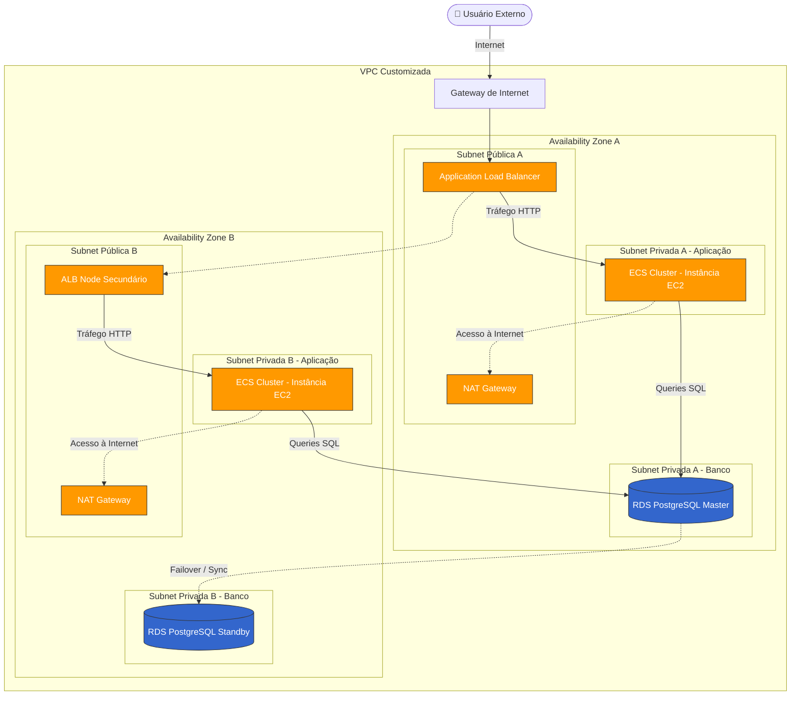

# 🏗️ AWS - Alta Disponibilidade (Projeto BIA)
> Aplicação Web em Alta Disponibilidade com VPC, EC2, ECS, RDS e ALB


---

## 📌 Sobre o Projeto

O projeto **BIA** é uma aplicação Fullstack (React + Node.js) concebida para servir de base em laboratórios avançados de Cloud e DevOps. 

O foco deste repositório é demonstrar não apenas o código da aplicação, mas o seu deploy em uma infraestrutura AWS desenhada para **alta disponibilidade, resiliência e segurança máxima**. A arquitetura garante que a aplicação continue funcionando de forma ininterrupta, isolando o tráfego e utilizando serviços gerenciados como Application Load Balancer, Auto Scaling Groups e containers no Elastic Container Service (ECS).

---

## 🛠 Stack Tecnológica

### Aplicação
- **Frontend:** React 17, Vite, React Router DOM
- **Backend:** Node.js, Express.js
- **Banco de Dados:** PostgreSQL, Sequelize (ORM)

### Infraestrutura e Deploy (AWS)
- **Networking:** VPC Customizada, Subnets (Públicas e Privadas), Internet Gateway, NAT Gateway
- **Compute:** ECS (Elastic Container Service) com instâncias EC2 otimizadas, Auto Scaling Group
- **Storage/DB:** RDS (PostgreSQL) Multi-AZ
- **Routing & Security:** Application Load Balancer (ALB), Security Groups granulares

---

## 🎯 Objetivos de Aprendizado e Prática

Com a implementação do BIA nesta arquitetura AWS, os principais pilares aplicados foram:

- [x] Configurar uma **VPC customizada** separando a rede em subnets públicas e privadas em múltiplas zonas (AZs).
- [x] Criar rotas de saída seguras utilizando **NAT Gateway** nas subnets públicas para os recursos privados.
- [x] Distribuir e expor o tráfego de forma segura através de um **Application Load Balancer (ALB)** internet-facing.
- [x] Subir a aplicação conteinerizada via **ECS** utilizando instâncias EC2 com **Auto Scaling Groups**.
- [x] Conectar a aplicação a um banco de dados relacional **RDS**, mantido isolado na subnet privada.
- [x] Executar rotinas de banco de dados e migrações (`sequelize`) em um ambiente containerizado.

---

## 🧱 Arquitetura da Infraestrutura



> 💡 *O diagrama acima ilustra o fluxo de tráfego seguro: o usuário acessa o ALB nas subnets públicas, que por sua vez roteia o tráfego para os containers do ECS executando em instâncias EC2 nas subnets privadas. O banco de dados RDS e o ECS utilizam o NAT Gateway para saídas seguras.*

### Principais Componentes Utilizados

| Serviço AWS | Função na Arquitetura |
|---|---|
| **VPC & Subnets** | Isolamento de rede em 2 AZs. Subnets públicas para o Load Balancer e NAT Gateway; privadas para aplicação e BD. |
| **NAT Gateway** | Permite que as instâncias EC2 e tasks do ECS em subnets privadas acessem a internet para baixar dependências, sem expor IPs públicos. |
| **ECS & EC2** | Cluster ECS orquestrando containers Docker que rodam nas instâncias EC2 associadas a um Auto Scaling Group. |
| **Application Load Balancer** | Ponto de entrada internet-facing da aplicação. Faz o roteamento e os *Health Checks* dos containers. |
| **Auto Scaling Group** | Garante a escalabilidade automática e a alta disponibilidade das instâncias EC2 do Cluster ECS. |
| **RDS (PostgreSQL)** | Banco de dados provisionado de forma segura sem acesso à internet, aceitando requisições somente do ECS. |

---

## ⚙️ Como a Arquitetura foi Implementada

Passo a passo resumido do deploy:

1. **Rede:** Criação de VPC com Subnets Públicas e Privadas em múltiplas zonas de disponibilidade.
2. **Saída Segura:** Configuração de NAT Gateways nas subnets públicas e apontamento nas Tabelas de Roteamento privadas.
3. **Segurança:** Isolamento através de Security Groups aplicando a regra de menor privilégio (Tráfego Externo → ALB → ECS → RDS).
4. **Armazenamento de Imagens:** Build e push da imagem Docker para o repositório **ECR**.
5. **Orquestração e Load Balancing:** Criação do ALB e do Cluster ECS. Definição da *Task Definition* e criação do serviço (Service) no ECS atrelado ao *Target Group* do Load Balancer.

*(Para o guia técnico passo a passo detalhado, consulte o arquivo [Plano de Projeto ECS BIA](./docs/plano_projeto_ecs_bia.md).)*

---

## 💡 Decisões Técnicas e Aprendizados

- **Instâncias em Subnets Privadas:** Manter a aplicação e o banco de dados em redes privadas garante que eles jamais sejam acessados diretamente pela internet. Todo tráfego precisa, obrigatoriamente, passar pela triagem e regras do Load Balancer nas subnets públicas.
- **Auto Scaling e ECS:** Utilizar um Auto Scaling Group no ECS garante que se uma instância EC2 falhar, o ASG cria uma nova e o ECS repassa as *Tasks* automaticamente, resultando em downtime próximo de zero.
- **Uso do NAT Gateway:** Vital para que o backend consiga se comunicar com APIs externas ou baixar atualizações sem expor sua infraestrutura.

---

## 📸 Evidências (Prints do Console AWS)

Abaixo estão as principais evidências da execução bem-sucedida da implementação na AWS:

<details>
<summary><b>Ver evidências do projeto rodando na AWS</b></summary>
<br>

### 1. Application Load Balancer (ALB)


### 2. Cluster ECS e Tasks em Execução


### 4. Aplicação Funcionando

</details>

---

## 🚀 Como Executar Localmente (Desenvolvimento)

Para rodar a aplicação BIA na sua máquina local de forma independente da nuvem, você precisa ter o **Docker** instalado.

1. Suba os containers locais utilizando o docker-compose:
   ```bash
   docker compose up -d
   ```

2. Após os containers subirem, crie e povoe o banco de dados (PostgreSQL) executando as migrations via container:
   ```bash
   docker compose exec server bash -c 'npx sequelize db:migrate'
   ```

3. **Acesso:** Aguarde os logs do Vite e da API subirem. Acesse o Frontend geralmente em `http://localhost:3000` e a API em `http://localhost:3001`.

---

## 🔗 Artigo Completo (Passo a Passo)

Escrevi um artigo profundo e detalhado explicando todo o processo de criação desta infraestrutura na AWS:

📖 **[Projeto Prático: Rodando uma aplicação no ECS com Subnet Privada, NAT Gateway e ALB](https://medium.com/@alanborges195/projeto-prático-rodando-uma-aplicação-no-ecs-com-subnet-privada-nat-gateway-e-alb-8807dc2f629b)**

---

## 📁 Estrutura Atual do Repositório

```
📁 bia/
├── docs/                 ← Documentação técnica, planos e imagens/prints
├── client/               ← Aplicação Frontend em React
├── backend/              ← Backend em Node.js
├── compose.yml           ← Orquestração para ambiente de desenvolvimento local
└── README.md             ← Esta documentação
```

---

## 👤 Autor

**Allan Felipe Antunes Borges**  
☁️ AWS Certified — Cloud Practitioner | Solutions Architect | Developer Associate  
🔗 [LinkedIn](https://www.linkedin.com/in/allan-fborges/) • [Medium](https://medium.com/@alanborges195) • [GitHub](https://github.com/allan-felipe23)
